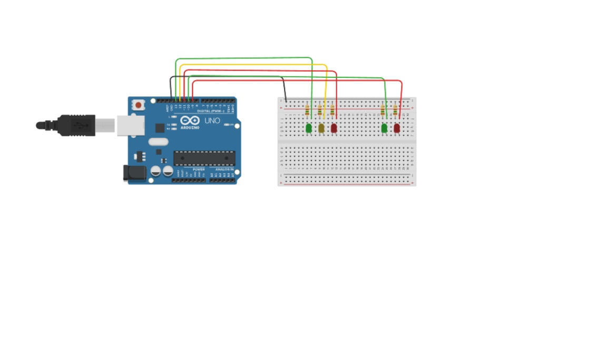

# semaforo

## Exercícios da página 15/16 da apostila de Portugol Studio

- Modadalidade: em Dupla
- Entrega: Github do grupo

Este material reescreve cada exercício e explica **como pensar logicamente** na construção do programa em Portugol, sem apresentar a solução completa pronta.  
A ideia é treinar a identificação de **entradas**, **processamento** e **saídas**.

---

## Exercício 1
